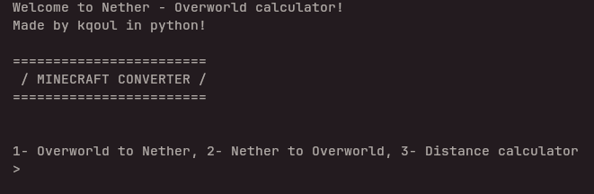

!!THIS IS WORK IN PROGRESS!!
===================================
/ Minecraft Conversion Calculator /
===================================

V1.1

-This is a CLI program that runs on the terminal via python 3, it uses basic math functions to calculate Minecraft coordinates in vairous ways such as accross dimenrsions or distance between one another

/ HOW IT WORK /

-Minecraft converts it's coordinates between the nether and the overworld, where 8 blocks in the overworld make one block in the nether
 Therefore this converter converts from nether to overworld by multiplying the numbers that the user prompted by 8 (or if the opposite we divide by 8)

-The distance converter takes the both coordinates and subtracts the smaller coordinate from the bigger one (in value) therefore giving us the distance between

/ FEATURES /

-Overworld ==> Nether coordinates conversion

-Nether ==> Overworld coordinate conversion

-Distance between blocks Calculator

-A clean and easy to navigate user interface

 / HOW TO INSTALL / USE /

**HOW TO INSTALL**

-Clone this repo:

"gh repo clone kqoul/Minecraft_Coordinate_Converter"

-Run main.py using python

**HOW TO USE**

-When opened, the program will state you with 3 options: nether to overworld, overworld to nether, distance Calculator
-Select the desired operation and enter the prompted values

/ ROADMAP /

V1.0 *current* 
-First polished release
-All stated features 

V1.5 
-Upgraded distance feature
-Fix more stability bugs

v2.0
-UI overhaul
-more conversion tools

V2.5
-Fix stabilty with new UI
-Add some TBD tools

/ AUTHOR /

Created my Ihatekqoul with love!